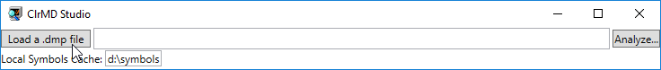
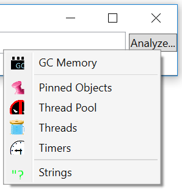
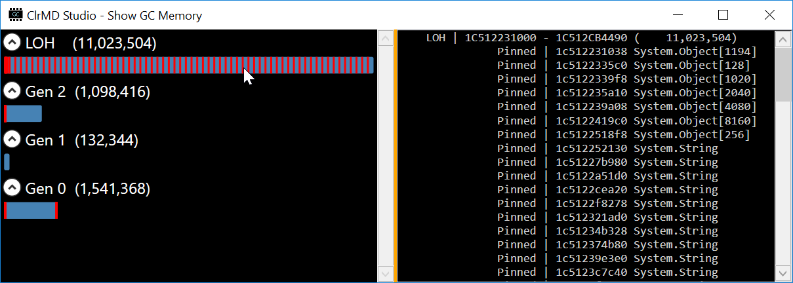
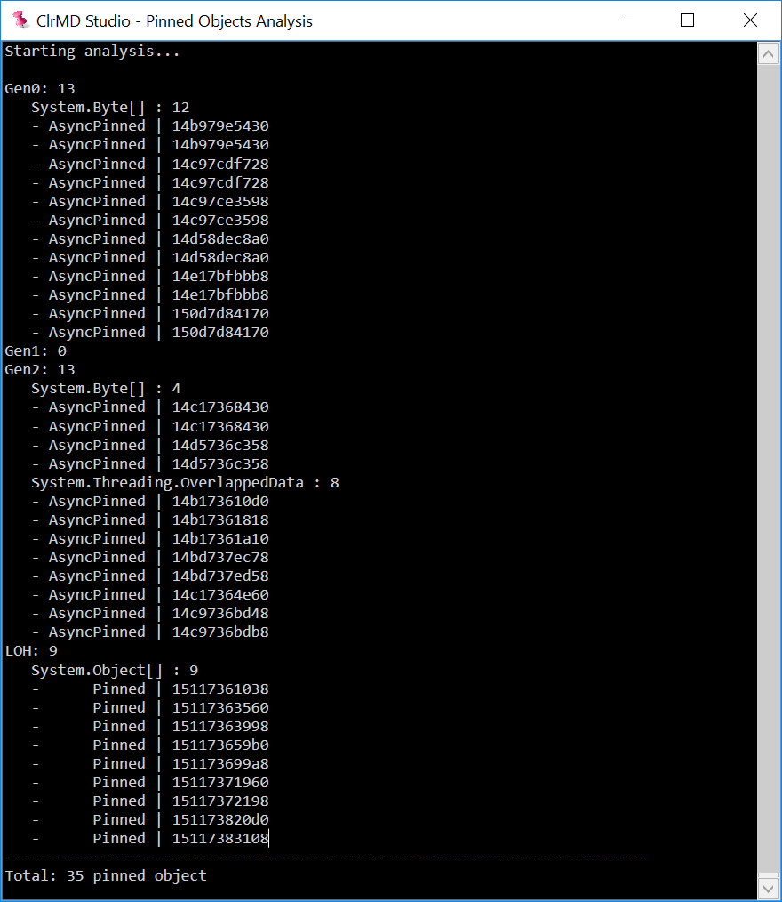
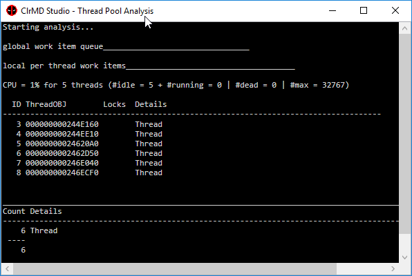
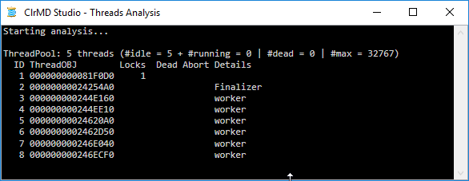
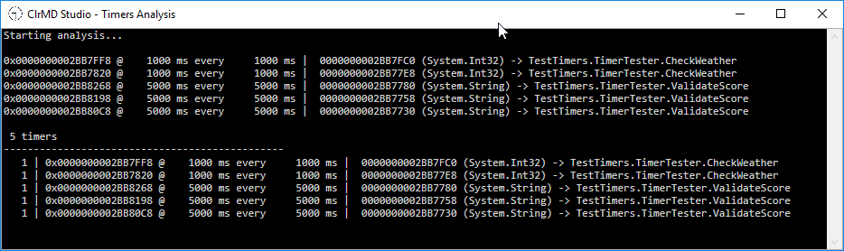

# ClrMDStudio

This tool allows you to load a .NET application memory dump file 

and to run a few analyzers:

## GC Memory

Show the layout of the different segments managed by the Garbage Collector and highlight the pinned objects in red and the free blocks in white. Click one segment on the left pane to get the details in the right  pane including the type name of the pinned objects with the array length if needed and the list of free blocks.

## Pinned Objects

List all pinned and async pinned objects per generation and sorted by type.

## Thread Pool

The details of pending/running tasks and thread pool work items are listed with the name of callbacks when available. Note that global/per thread local queues are also available.

## Threads

Basic thread statistics are provided with details for each thread.

## Timers

List timers details up to the callback method and a summary to more easily identify possible leaks.

## Strings
Look for duplicate strings and possible usage of interning.

