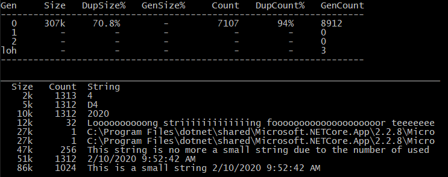

# dstrings

This .NET Core tool allows you to load a .NET application memory dump file or attach to a live process and displays some statistics about the duplicated strings.

If you need to specify the path to the mscordac file, pass it after --dac 
Use -s (for size threshold) or -c (for count threshold) if needed to filter more the strings display after the statistics summary table

## Platforms
As a .NET Core console application, it runs on Windows and Linux.
