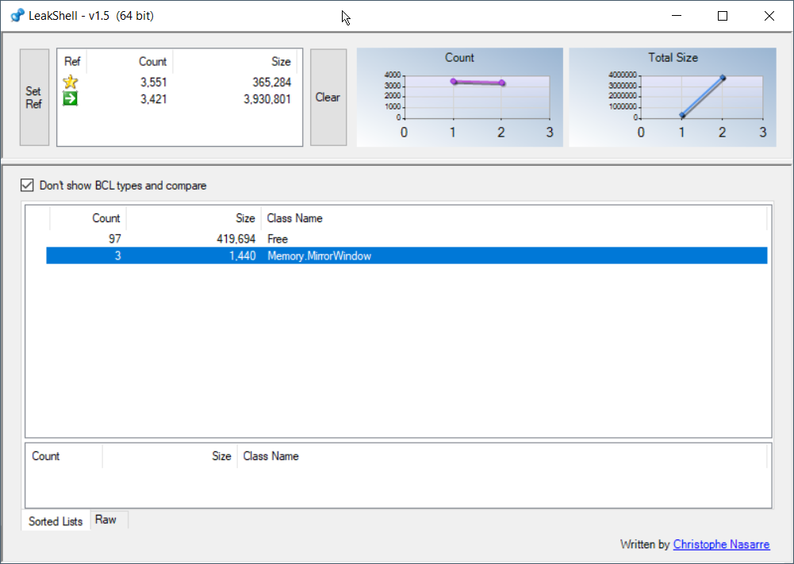

# LeakShell

This WinForms tool allows you to easily spot instances of types that might be leaking over time.

It can be used as a WinDBG companion or by simply drag/drop memory dump files to compare their content.
Look at the [original post from 2011](https://codenasarre.wordpress.com/2011/05/18/leakshell-or-how-to-automatically-find-managed-leaks/) for more details.
