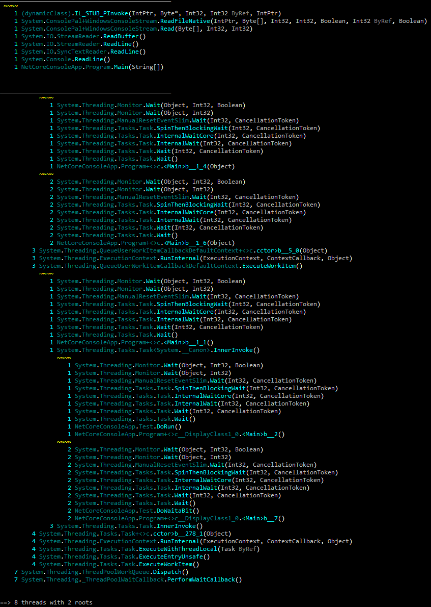

# pstacks

This .NET Core tool allows you to load a .NET application memory dump file and displays the merged threads call stacks à la Visual Studio "Parallel Stacks".

If you need to specify the path to the mscordac file, pass it as the second parameter (just after the dump file name)

## Platforms
As a .NET Core console application, it runs on Windows and Linux.
Note that it is not possible to attach to a live process on Linux (but could be adapted on Windows is needed)